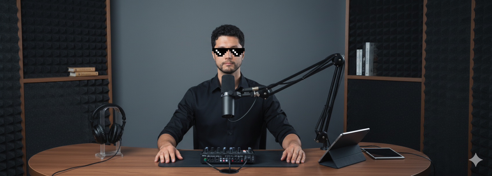
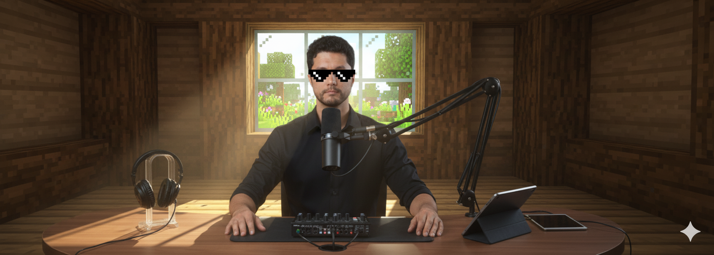
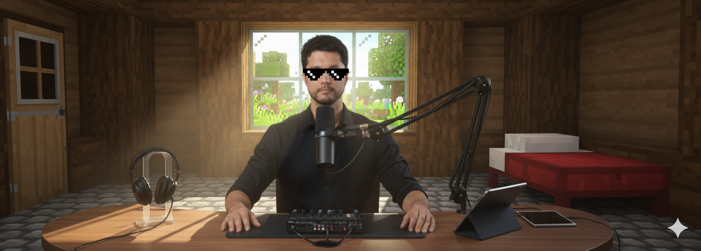
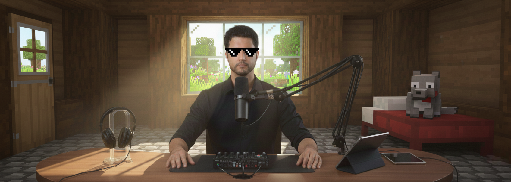
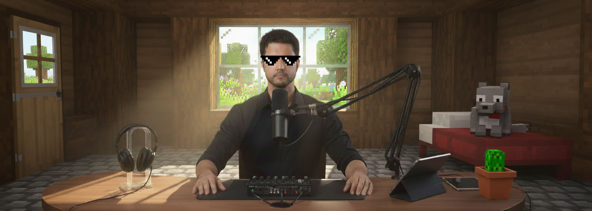

# Image Generation

Summary:
1. [Home](./README.md)
2. Generate Text
3. Generate Audio
4. Generate SFX
5. Final Result

I started by creating an image for the podcdast. To do so, I went to [Google AI Studio](https://aistudio.google.com/) and generated an image with Nano Banana.

Using [this image](./assets/images/me.png) as initial input I asked:

> This is me, make me wear that meme sunglass and put me in a home podcast room.

This was the result.

Then I asked:

> Make the background look like the interior of a Minecraft house, made from oak planks and logs. In the center, behind me, there must be a window showing the nature (in Minecraft style) during the morning. Use shaders for better/realistic light and shadows.

And I got this.

But I felt the room was kinda empty and that somethig was missing... so I asked:

>The floor must be made of stone blocks. There must be a door in the left, and a bed in the right.

Better right?

But I wasn't satisfied... so I did "one last prompt".

>Add a Minecraft domesticated wolf sitting on the bed, also, the door window must show the outside as well.

And I got this masterpiece... or almost.

I decided to go a little furter:

> Add a small pot with a cactus, in Minecraft style, on the table.

Then I finally got satisfied.

So I did one LAST call... 

>Create a logo for a podcast, based on the elements of this image. The logo must be clean, modern, and kinda abstract. When looking at it, people must think about technology, podcast and Minecraft.
Don't write any words in this logo.

